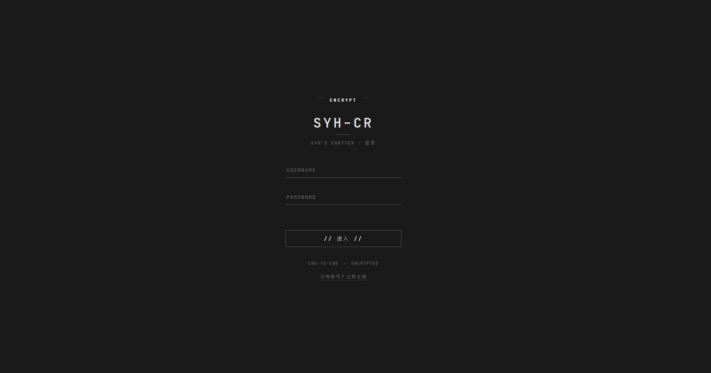

# syh's chatter

一个基于 **Flask** 和 **MongoDB** 的轻量级聊天室应用，支持多用户实时交流、文件上传、邀请码注册、权限组、管理员控制面板、插件系统与主题切换动画。
**新特性**：可作为一个可嵌入的 Python 包（`chatter`）挂载到任意 Flask 应用中；首次启动提供 **Web 初始化向导**，一切通过界面完成。



---

## ✨ 功能特性

- 💬 **实时消息**：轮询刷新，近实时聊天体验
- 🧩 **结构化消息**：JSON 消息 ID、回复引用、软撤回、系统公告与服务端禁言
- 👤 **用户系统**：自定义昵称与颜色，密码使用 `werkzeug` 哈希存储
- 🛡 **权限组**：细粒度权限点（消息、命令、管理、插件），可自定义权限组（见下文）
- ⚙️ **管理面板**：聊天室弹窗 + 独立页面，管理用户 / 权限组 / 插件 / 流量 / 数据库 / 设置
- 🔌 **插件系统**：文件夹式与单文件式插件，支持命令、钩子、页面、CSS/JS 注入
- 📎 **文件上传**：自动识别图片、音频、普通文件（`::img::`、`::wav::`、`::file::` 标记）
- 🗺 **挂载路径（base_path）**：聊天室可挂载到任意子路径（如 `/chat`），也可嵌入宿主 Flask 应用
- 👑 **管理员命令**：`command: clear` / `command: delete N` / `command: change_color 用户 颜色`
- 🔐 **安全注册**：邀请码注册，初始邀请码在初始化时自动生成
- 👥 **在线列表**：动态显示当前在线用户
- 💾 **MongoDB 持久化**：消息与流量统计入库（MongoDB 不可用时自动降级为 mongomock 内存存储）
- 🎬 **动画**：黑白主题切换的圆圈扩散动画（clip-path 从按钮中心扩散）、页面错峰出场动画

---

## 📦 环境要求

- Python 3.6+
- MongoDB（生产环境建议启动以持久化消息；无 MongoDB 时自动使用内存回退）
- pip

---

## 🚀 安装与配置

### 1. 克隆与安装依赖

```bash
git clone https://github.com/syh100925/syh-s-chatter.git
cd syh-s-chatter
pip install -r requirements.txt
```

> `werkzeug` 提供密码哈希；`charset-normalizer` 用于 `.cpp` 文件在线预览；无 MongoDB 时使用 `mongomock` 内存回退（重启后消息丢失）。

### 2. 启动与初始化

```bash
python server.py
```

访问 `http://<服务器IP>:5000`，自动跳转 `/init` 初始化向导，填写：

- **MongoDB 连接信息**（IP、端口、用户名、密码，可测试连接）
- **服务器地址**（生成跳转链接用，如 `192.168.1.100:5000`）
- **挂载路径**（可选，如 `/chat`，决定聊天室访问前缀）
- **管理员账号** 与 **初始邀请码数量**

初始化完成后页面展示邀请码，凭邀请码注册新用户。

---

## 🧱 架构（v2 模块化）

代码组织为可嵌入的 `chatter` 包：

```
chatter/
├── __init__.py          # create_app() / register_into() 工厂
├── blueprints/          # init_routes / auth_routes / chat_routes / admin_page / admin_api
├── templates/           # chat.html（瘦模板）、admin.html、admin_content.html ...
├── config.py            # config.json 读写与默认设置
├── permissions.py       # 权限组、权限点、展开与检查
├── plugin_manager.py    # 插件发现/加载/钩子/注入
├── traffic.py           # 流量统计（MongoDB traffic 集合）
└── ...                  # auth / users / messages / attachments / commands / database / state
static/
├── css/chat.css         # 聊天室样式（已从模板抽出）
└── js/chat.js           # 聊天室脚本（已从模板抽出）
plugins/                 # 插件目录（文件夹式 + 单文件式）
tests/smoke_test.py      # 14 项冒烟测试
```

### 独立运行

```python
# server.py 实际内容即如此
from chatter import create_app
app = create_app()          # 支持 create_app(base_path='/chat', data_dir='./data')
```

### 嵌入宿主 Flask 应用

```python
from flask import Flask
from chatter import register_into

app = Flask(__name__)
register_into(app, base_path='/chat', data_dir='./data')
```

`register_into` 会注册全部蓝图、`before_request` 初始化检查（未初始化自动跳 `/init`）、流量记录、模板上下文（`base_path`、`site_title`、插件注入等）并加载插件。
若宿主与聊天室结构差异较大，也可用 `werkzeug` DispatcherMiddleware 挂载整个应用：

```python
from werkzeug.middleware.dispatcher import DispatcherMiddleware
from chatter import create_app

chat_app = create_app()
app.wsgi_app = DispatcherMiddleware(app.wsgi_app, {'/chat': chat_app})
```

注意：挂载路径改变（`base_path`）后需重启服务生效。

---

## 🛡 权限组

权限点以 `域.动作` 命名，支持通配符：

| 权限点 | 说明 |
| --- | --- |
| `message.send` / `message.recall.any` | 发消息 / 撤回任意消息 |
| `chat.clear` / `chat.delete` / `chat.change_color` | 清屏 / 删消息 / 改颜色 |
| `moderation.mute` / `moderation.unmute` | 禁言 / 解除禁言 |
| `admin.panel` / `admin.users` / `admin.groups` / `admin.plugins` | 管理面板各板块 |
| `admin.traffic` / `admin.database` / `admin.settings` | 流量 / 数据库 / 设置 |
| `admin.tools` | 快捷工具链接管理 |
| `plugins.<插件>.<动作>` | 插件自定义权限点 |

- 权限组定义在 `config.json` 的 `permission_groups`（组名 → 权限列表），默认三组：
  `admin`（`*`）、`moderator`（消息 + 删消息 + 禁言）、`user`（发消息）
- `user_groups` 保存 用户 → 组 映射，`default_group` 为默认组
- `admins` 列表中的用户自动拥有全部权限
- 在 **管理面板 → 权限组** 中可视化编辑，实时生效

---

## 🔌 插件系统

插件目录 `plugins/`，支持两种格式，加载后提供聊天命令、钩子、页面、CSS/JS 注入。
完整 API 说明见 **[Plugin.md](Plugin.md)**（PluginContext 全部方法、钩子事件表、命令签名、权限点约定与示例讲解）。

### 文件夹式

```
plugins/my_plugin/
├── manifest.json     # {"name": "my_plugin", "version": "0.1.0", "author": "…", "entry": "main.py"}
├── main.py           # 入口，定义 on_load(ctx)
└── config.json       # 插件配置（可选，管理面板可编辑）
```

### 单文件式

```python
# plugins/echo.py（项目自带示例）
PLUGIN_INFO = {'name': 'echo', 'version': '0.1.0', 'author': 'syh'}

def on_load(ctx):
    def cmd_echo(username, parts, d_time, command_str):
        from chatter import messages
        return messages.add_system_message('[echo] ' + command_str[len('command: echo'):].strip())
    ctx.add_command('echo', cmd_echo, permission='plugins.echo.echo')
```

### PluginContext 能力

| 方法 | 用途 |
| --- | --- |
| `ctx.add_command(name, fn, permission, description)` | 注册聊天命令（`command: 名称 …`） |
| `ctx.on(event, handler)` | 钩子：`message_send`、`chat_data`、`login`、`logout`、`register`、`message_recall` |
| `ctx.register_blueprint(bp, url_prefix)` | 注册页面/API 蓝图 |
| `ctx.add_css(...)` / `ctx.add_js(...)` | 注入 CSS / JS（原始代码或插件内文件路径） |
| `ctx.add_tool_link(title, url)` | 加入聊天室“工具集”弹窗 |
| `ctx.get_config(key, default)` / `ctx.set_config(key, value)` | 读写插件 `config.json` |

插件可访问 `chatter` 包内任意模块（`messages`、`permissions`、`state` 等）。启用/禁用可在管理面板即时切换；注册蓝图类变更需重启服务。

---

## ⚙️ 管理面板

拥有 `admin.panel` 权限的用户点击聊天室右下角 **🛡** 按钮打开管理弹窗（独立访问 `http://<host>/admin?update=<token>`），包含：

- **用户**：改颜色、改权限组、改名、重置密码、删除、批量生成邀请码
- **权限组**：增删组、勾选权限点、设置默认组
- **插件**：启停、重载、编辑 JSON 配置
- **流量**：总请求数、今日请求、独立 IP、近 7 天柱状图、热门路径
- **数据库**：消息统计、dbstats、按用户查消息、删除用户消息、清空记录
- **设置**：站点标题、服务器地址、端口、轮询间隔、默认禁言时长、挂载路径、管理员列表
- **快捷工具**：编辑聊天室"工具集"弹窗中的自定义链接（与插件提供的链接一同展示）

---

## 👑 聊天命令

管理员/有权限用户在输入框发送：

- `command: clear` – 清空聊天记录
- `command: delete 10` – 删除最后 10 条消息
- `command: change_color 张三 #00ff00` – 修改用户颜色
- 插件注册的命令（如 `command: hello 张三`、`command: echo 你好`）

---

## 🎨 主题与动画

- 点击右上角 **主题** 按钮：黑白主题通过从按钮中心扩散的 `clip-path` 圆平滑切换（约 500ms）；系统开启“减少动态效果”时直接切换
- 页面元素错峰出场动画；所有动画尊重 `prefers-reduced-motion`
- 样式：`static/css/chat.css`；脚本：`static/js/chat.js`；管理面板：`static/js/admin.js`

---

## 🗄️ 数据库结构

- 数据库：`chats`
- 集合：`values`（消息）、`mutes`（禁言）、`traffic`（流量，需管理面板查看）
- 消息文档字段：`id`（UUID）、`user`、`content`（含类型标记）、`color`、`time`、`created_at`、`type`（text/image/audio/file/emoji/system）、`recalled`、`reply_to`

---

## 🧪 测试

```bash
python tests\smoke_test.py     # 冒烟测试（初始化、注册、登录、发消息、撤回、命令、禁言、权限）
```

---

## 📁 文件说明

- 数据文件（`config.json`、`usernames.list`、`passwords.list`、`colors.list`、`invite_code.txt`、`log.txt`）位于项目根目录，可经 `create_app(data_dir=...)` 迁移
- 上传文件保存在 `static/uploads/`，表情包在 `static/emoji/`

---

## ❓ 常见问题

**Q：没有自动跳转初始化页面？**  
A：删除 `config.json` 与 `usernames.list` 后重新访问。

**Q：聊天记录重启后丢失？**  
A：未连接上 MongoDB，使用了内存回退。检查 MongoDB 与 `config.json` 连接信息。

**Q：挂载路径修改后不生效？**  
A：`base_path` 在启动时注册路由，修改后需重启服务。

**Q：插件蓝图在“重载”后未更新？**  
A：Flask 在首次请求后不允许注册新蓝图，此类变更需重启服务；命令与钩子即时生效。

---

## 📄 许可证

本项目仅供学习交流使用，请勿用于非法用途。
